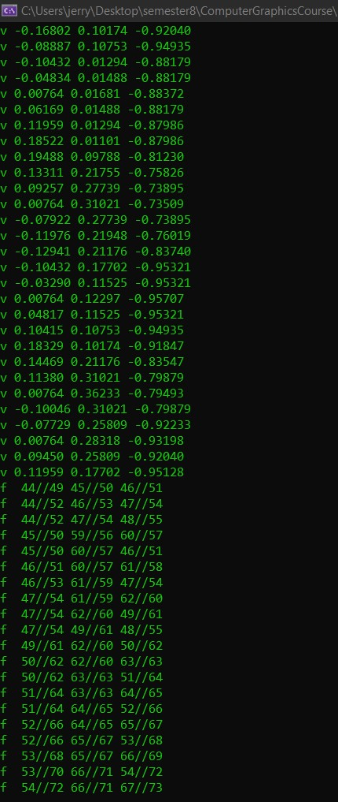

# Assignment1Report_part2

Using std we added a printing function to the code which prints the vectors of the vertices and faces, like in the image below :-

object used in the demo: bunny

```c++
if (lineType == "v")
		{
     vertices.push_back(Utils::Vec3fFromStream(issLine));
		 std::cout << issLine.str() << std::endl;
		}
		else if (lineType == "vn")
		{
			normals.push_back(Utils::Vec3fFromStream(issLine));
		}
		else if (lineType == "vt")
		{
			// TODO: Handle texture coordinates
		}
		else if (lineType == "f")
		{
			faces.push_back(Face(issLine));
			std::cout << issLine.str() << std::endl;

		}
		else if (lineType == "#" || lineType == "")
		{
			// comment / empty line
		}
		else
		{
			// std::cout << "Found unknown line Type \"" << lineType << "\"";
		}
```



We added a scaling factor and a transaltion to the object in order for it to fit the screen properly like so:-
```c++
point1 = model.getTransformedVertices().at(model.GetFace(j).GetVertexIndex(0) - 1);
			point2 = model.getTransformedVertices().at(model.GetFace(j).GetVertexIndex(1) - 1);
			point3 = model.getTransformedVertices().at(model.GetFace(j).GetVertexIndex(2) - 1);

			point1 += glm::vec2(half_width, half_height);
			point2 += glm::vec2(half_width, half_height);
			point3 += glm::vec2(half_width, half_height);
			
			DrawLine(point1, point2, glm::vec3(1.0f));
			DrawLine(point1, point3, glm::vec3(1.0f));
			DrawLine(point2, point3, glm::vec3(1.0f));
```
where in getTransformedVertices() we cut the w coordinate and divide each coordinate by it, then we drew it using the DrawLine() function we implimented the previous task.

this is the result, object used in the demonstration: bishop and teapot


### Transformation Gui
we can control each transformation individually by this window


