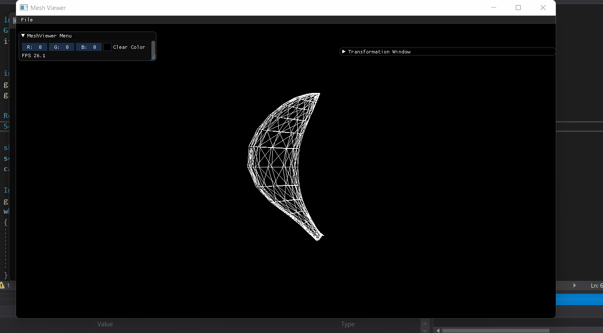

# Assignmnet1Report_Part3

#### Overview
this is part 3 of assignment 1, basically we added a couple of features to the previous part, we modified the GUI such that now it can also draw all axess for different models and the world axes, also now we have the ability to add cameras and do different operations using these cameras like rotations and translations, and because we can add multiple cameras we can also change our "eye" and our point of view on the models.
gifs and screenshots will make it easier to understand down the page.

## Cameras

#### Orthographic Perspective
we implimented a camera with an orthographic projection, and gave the user the ability to change the view volume in different directions using the UI.
we also let the user move the camera around in the space.

** near and far don't affect the projection here **

#### Projection


#### Camera Location


#### Rotations

here we can see the difference between camera rotaions in local form and in world form.


### Resizing windows

the user can now change and resize the meshviewer window with the model staying in the relative position as it was, for example if the model was in the center it will still be in the center relative to the new window size.

we did that by calling the render function again with the new dimensions.



### Axis Drawings and Relative Transforms

We can now draw the world and model Axes in the meshview and display them on the screen so it is easier for us to understand the transform, in the gif below we see transformations and how they appear reatively between the different axes for the model and the world.


here we clearly see how the transforms are done relative to the axes as well


### Non-Commuting Transformations

let's show 2 different transformations and see that they are not commutative, first we'll apply local translate then world rotation, and then we'll apply world translation then local rotation.

#### Local Translate And World Rotation


#### World Translate And Local Rotation


### Bounding Box

we drew a bounding box around the model such that it is the minimal rectangular 3D box that it's lines are parralel to the axes.

**Note** this is an older picture of the program that we had, if you try to check the bounding box now it doesn't always work, the FPS goes way down and it gets laggy, sometimes it even crashes and doesn't respond, we might check it out later, but it works nonetheless as shown in the image below.


### Vertex Normals

We added Vertex and Faces normal vectors, you can use the checkbox in the GUI to display them on screen and scale them accordingly using the slider.


code for face normal calculations:-

``` c++
glm::vec3 U = p2 - p1;
glm::vec3 V = p3 - p1;

float x = (U.y * V.z) - (U.z * V.y);
float y = (U.z * V.x) - (U.x * V.z);
float z = (U.x * V.y) - (U.y * V.x);
```
Vertex normals are already in the OBJ file.

### Perspective Projection

In the UI, like the orthographic projection, the user can change the field of view including near and far which have effect here.

here is a gif showing the comparison between the 2 persepctives.

in the perspective we can see the object coming closer to the camera.

#### Perspective


#### Orthographic


### Frustum Small

the 3D effect is pretty strong here, we can look at the head and the tail of the bunny to fully comprehend.


### Frustum Big

the 3D effect is pretty weak here, it is almost like a 2D drawing, we can look at the head and the tail of the bunny and see that the distance is negligible.


### Position at (1,1,1)

We set the camera at position (1,1,1) and set the view volume to look at the object so we can get a point of view from that particular point.


### Multiple Objects And Cameras

we can load multiple objects and cameras to the scene and switch between the cameras to get different point of views as shown below.


here we can see the cameras as objects from the other camera's view (behind the banana)
we switch the view between cam0 and cam1 and the cameras actually appear in the background


### GUI

here is a small tutorial on the Gui we implimented

**Note** we also added a FPS measurer in the window where we change the background color.


