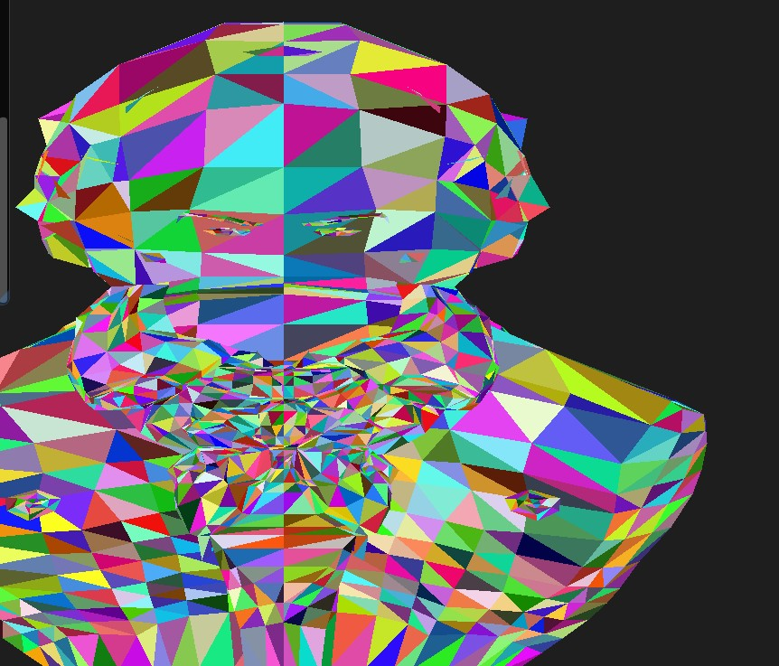
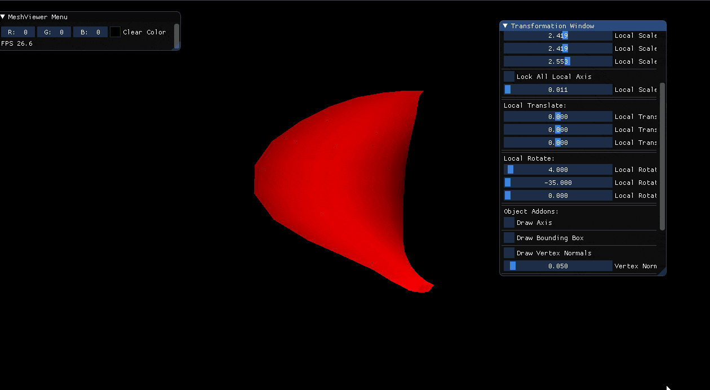
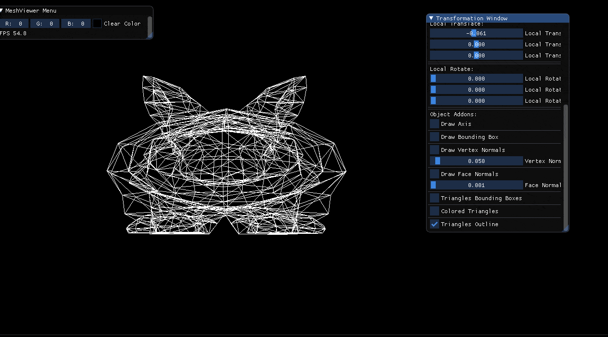

# Assignment2Report-part1

The user can now draw a bounding box around each triangle in the model and color them using the **Scan Line approach**, we made the colors appear randomly in the renderer, we can  toggle them off and on via checkboxes in the GUI.

**GIF example:**

### Z-Buffer

We implemented the z-buffer such that we prioritized the triangles that are closer to the camera, also we implemented the gray scale approach we talked about in the lecture where pixels are colored using linear interpolation between the chosen color and a darker color as we get further back from the camera.

here showcase the beethoven model, we used this because it is easy to see when the triangles in the face and the back of the head overalp.

**Without Z-Buffer**

**With Z-Buffer**

**Linear Interpolation and 1 color coloring**

