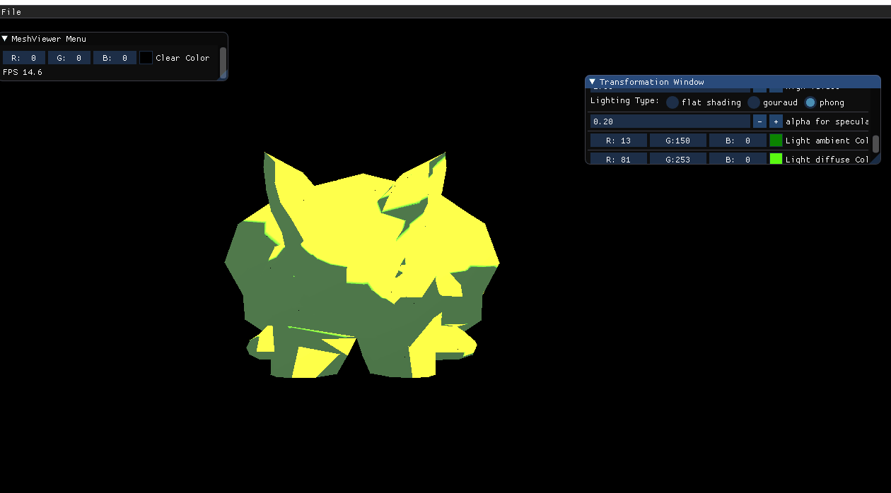
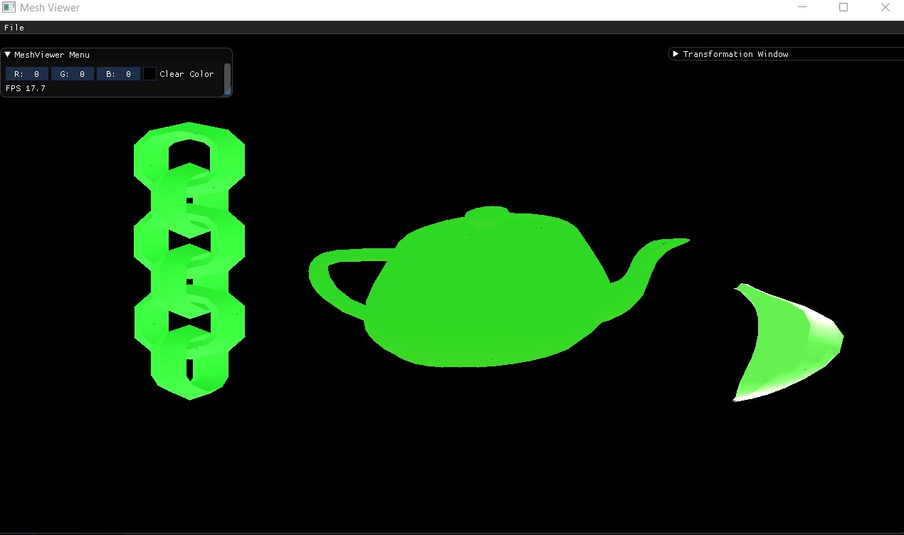

# Assignment2Report-part2

In this Assignment we added the abilities to add light sources and display multiple shading models.
in other words we added the Ray tracing technique, so in order to see the models now we first have to add light sources to the scene and define the shading technique.

first we added to the meshmodel and to the newly created light class 3 RGB values for the ambient, specular and diffuse lights.

```c++
glm::vec3 ambientColor = glm::vec3(1.0f, 1.0f, 1.0f);
glm::vec3 diffuseColor = glm::vec3(1.0f, 1.0f, 1.0f);
glm::vec3 specularColor = glm::vec3(1.0f, 1.0f, 1.0f);
```
we ran the program with the light set on red and we got the following output


furthermore, we changed the mesh color to blue then we changed the lighting color so we can only see the "blue part" of the mesh color like below.

**note that we can see the "blue part" that's being displayed by the RGB values of the light in the display window, and that is the part that is the model's color.


then we added the diffuse component to the scene and we got the following output


next we implemetned the regular flat shading and we got this output


we tweeked some of the parameters and got this output as well:


next step was to implement the gouraud shading, we got the following results:
we can see the difference clearly on the edges of the triangles between the transitions and the continuity of the colors.


we tweeked some of the parameters and got this output as well:


next we added a temporary piece of code that draws the light refections off the triangles like the face normal vectors that we drew in assignment 1c.


next we added the phong shading, we can clearly see the difference here as well as it gives us a more "cartoony" look and the mirrory reflections with the low contrast between triangles.


we tweeked some of the parameters and got this output as well:


we added a variable that gives us control over the intensity of the shader, that way we can control it and give it a mirror effect or a matte effect.



## Shadings on Different Models

### Flat Shadings


### Gouraud Shading



### Phong Shadings


