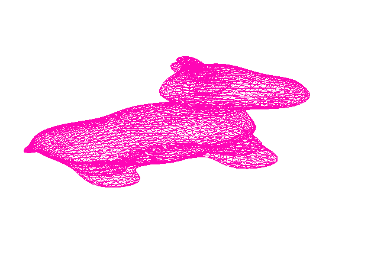
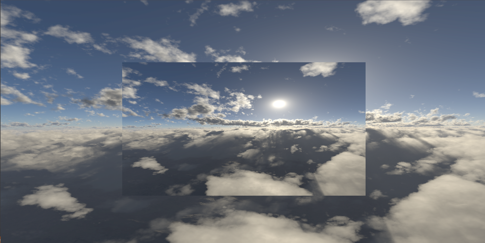

# Assignment-3-Report

## 1

the program creates an identifier for a texture in opengl and for a vertex array object (VAO).
then copies the vertex data and textures into a buffer.
it creates a vertex  and fragmant shader programs, and tells the shaders where to look for the vertex position data, and the data dimensions.


## 2

we loaded a mesh model onto the GPU.

## 3

Vshader Code:-

```c++
#version 330 core

layout(location = 0) in vec3 pos;
layout(location = 1) in vec3 normal;
layout(location = 2) in vec2 texCoords;

// The model/view/projection matrices
uniform mat4 model;
uniform mat4 view;
uniform mat4 projection;

// These outputs will be available in the fragment shader as inputs
out vec3 orig_fragPos;
out vec3 fragPos;
out vec3 fragNormal;
out vec2 fragTexCoords;

void main()
{
	// Apply the model transformation to the 'position' and 'normal' properties of the vertex,
	// so the interpolated values of these properties will be available for usi n the fragment shader
	mat4 MainMatrix = projection * view * model;
	orig_fragPos = vec3(vec4(pos, 1.0f));
	fragPos = vec3(MainMatrix * vec4(pos, 1.0f));
	fragNormal = vec3(MainMatrix * vec4(normal,1.0f));

	// Pass the vertex texture coordinates property as it is. Its interpolated value
	// will be avilable for us in the fragment shader
	fragTexCoords = texCoords;

	// This is an internal OpenGL variable, we must set a value to this variable
	gl_Position = MainMatrix * vec4(pos, 1.0f);
}

```

## 4
fragment Shader which ouputs a single color:
```c++
#version 330 core

struct Material
{
	sampler2D textureMap;
	// You can add more fields here...
	// Such as:
	//		1. diffuse/specular relections constants
	//		2. specular alpha constant
	//		3. Anything else you find relevant
};

// We set this field's properties from the C++ code
uniform Material material;
uniform vec3 MeshModelColor;

// Inputs from vertex shader (after interpolation was applied)
in vec3 fragPos;
in vec3 fragNormal;
in vec2 fragTexCoords;
in vec3 orig_fragPos;
// The final color of the fragment (pixel)
out vec4 frag_color;

void main()
{
	// Sample the texture-map at the UV coordinates given by 'fragTexCoords'
	vec3 textureColor = vec3(texture(material.textureMap, fragTexCoords));

	frag_color = vec4(MeshModelColor,1.0f);
}
```

## 5 Mesh Display
we loaded all the variables and parameters to the GPU in the main.cpp.

```c++
colorShader.setUniform("model", currentModel->GetWorldTransformation() *currentModel->GetModelTransformation());
colorShader.setUniform("camera", camera.GetViewTransformation());
colorShader.setUniform("projection", camera.GetProjectionTransformation());
colorShader.setUniform("material.textureMap", 0);

colorShader.setUniform("material.objAmbientColor", currentModel->ambientColor);
colorShader.setUniform("material.objDiffuseColor", currentModel->diffuseColor);
colorShader.setUniform("material.objSpecularColor",currentModel->specularColor);

colorShader.setUniform("material.lightAmbientColor", scene->GetLigh(0->ambientColor);
colorShader.setUniform("material.lightDiffuseColor", scene->GetLigh(0->diffuseColor);
colorShader.setUniform("material.lightSpecularColor", scene->GetLigh(0->specularColor);
colorShader.setUniform("material.alpha", scene->GetLight(0)->alpha);

colorShader.setUniform("material.lightPos", scene->GetLight(0)->GetPosition());
colorShader.setUniform("material.eye", camera.GetEye());
```

and we got the following output using spot.obj file:-

note that we can see the initial coloring on the model being the same as when we loaded the box in the original demo.


then we applied different transformations on the model eg. rotations, scaling and translations on the z axis which we can see the model being slightly invisibile.


then we put a specific color on the model and got the following output.




then we applied "fill" on the model and got the following output.


## 6 Lighting

light is at origin.

#### 1
specular is at 1.


specular is at 32.


specular is at 64.


with rotation.


Phong shading on Cow with different colors and different backgrounds, with different values.


## 7 Textures
here we apply different textures on a cow model.

#### Simple:


#### Plane:


#### Cylinder:


#### Sphere:


## 8

#### Environment Mapping

we used 6 pictures that we found online to construct this environment.




#### Toon Shading

we can see the levels of brightness on the ball very clearly.


